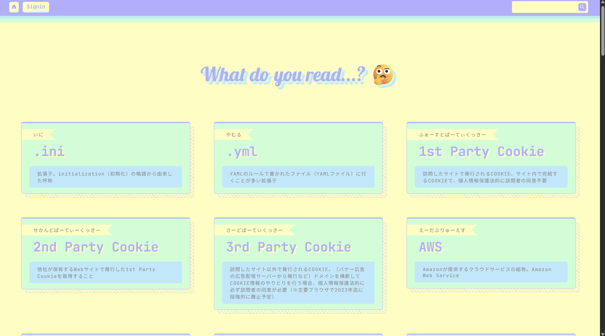
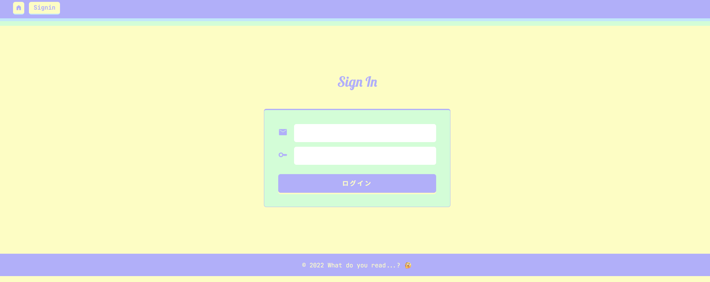
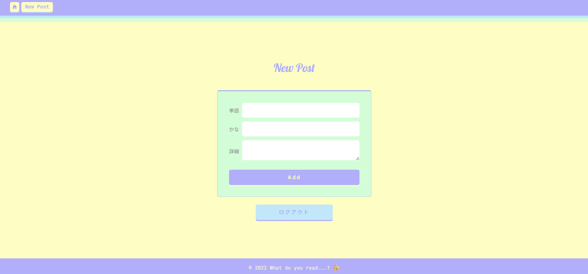
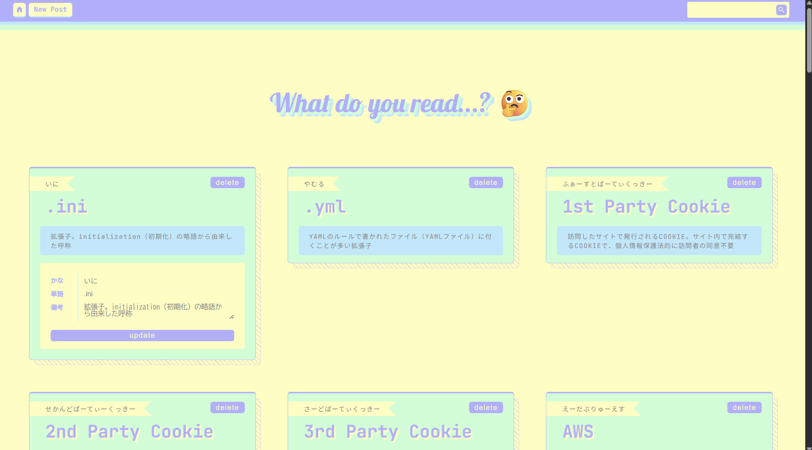
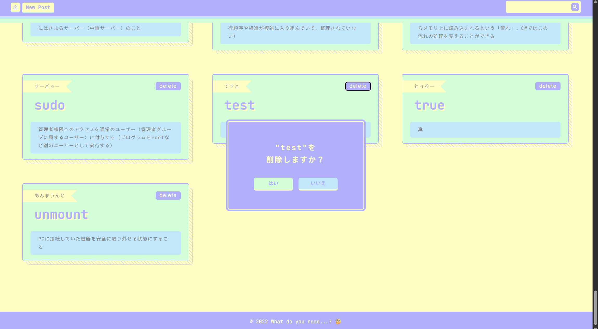
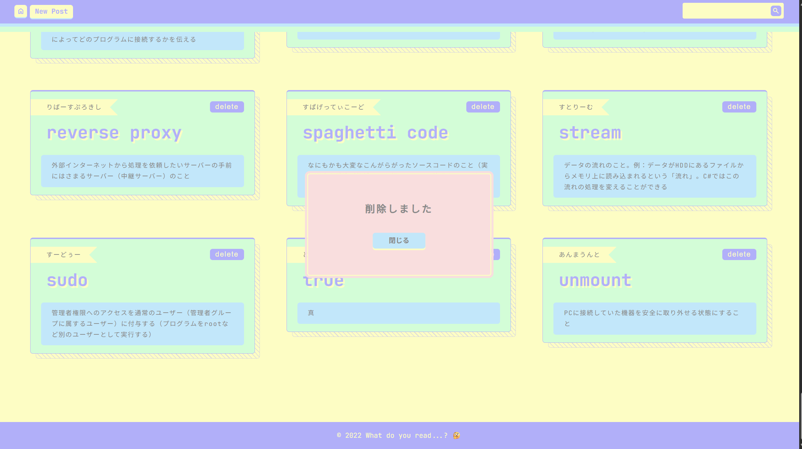

## 🚧 このリポジトリは現在リファクタリング中です 🚧

- 2022 年作の自作プロジェクトで全体的にかなり古いので、コードを整理してモダンな構成に移行中。（Issue 管理）

# readwords 🤔

「この単語どう読むんだっけ？」「意味ざっくり知りたい！」ときにサクッと検索・投稿できる WEB サイトです。(自分用)  
かつ Firebase の学習目的で作成しました。

## 🚀 技術スタック（移行中含む）

使用ライブラリなどは [package.json](./package.json) を確認。

## 📸 画面イメージ

- TOP
  
- ログイン画面
  
- 投稿画面
  
- 再編集時
  
- 削除時
    
  
