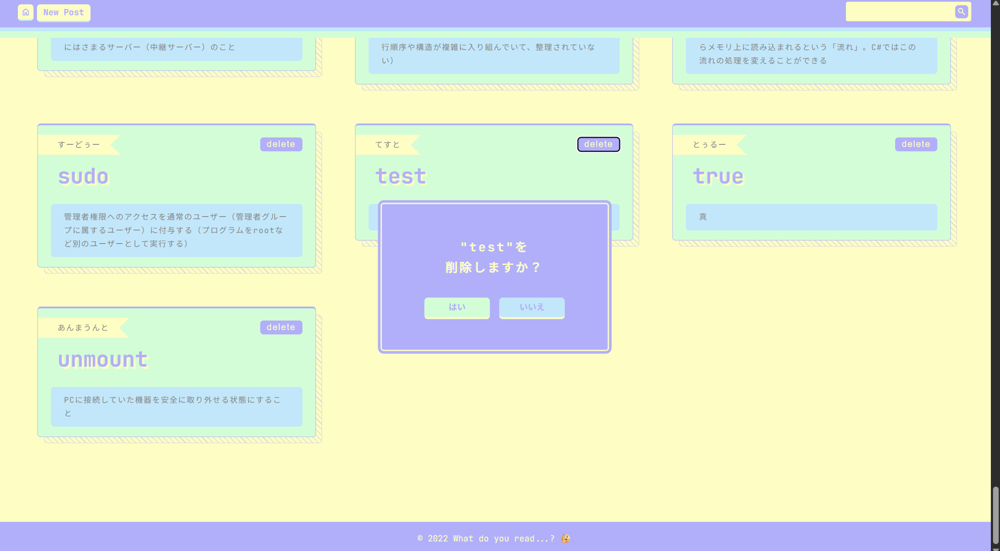
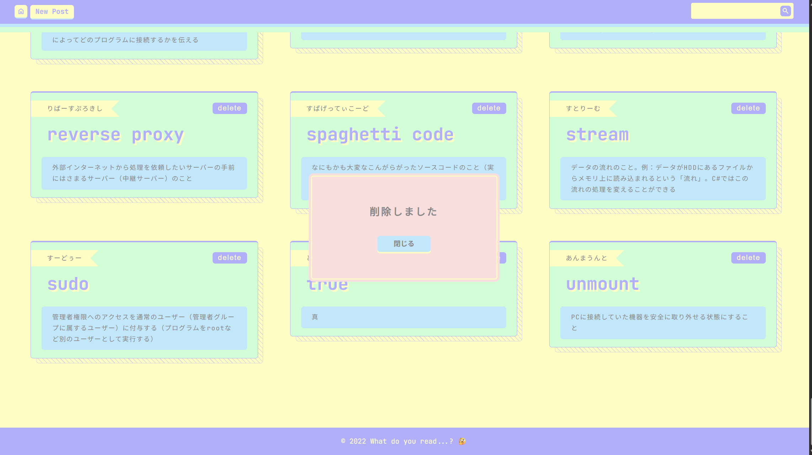

## 🚧 このリポジトリは現在リファクタリング中です 🚧

- 2022 年作の自作プロジェクトで全体的にかなり古いので、コードを整理してモダンな構成に移行中。
- 【現状進捗】
  - [x] （20250908）Vue2 +JS 構造は一旦そのままで Vue3+TS に変更。全体見直しはまだ。
  - [x] （20250909）CSS は FLOCSS で、 Vue で SCSS もたない。
- 【今後の目標】
  - [ ] 全体的に構造見直し。
  - [ ] 全体的にコードリファクタ。JSDoc いれる。
  - [ ] ビルド設定見直し。
  - [ ] firebase 見直し。Vue 側は薄く持ちたい。
  - [ ] Vercel でホスト。
  - [ ] 現行の firebase 仕様に合わせて検索の精度上げたい。
  - [ ] 投稿画面改修。バリデーション見直し。
  - [ ] frontend か backend かタグ付けしときたい。
  - [ ] 一覧の並び順を大文字小文字で分けたくない。

# readwords 🤔

「この単語どう読むんだっけ？」「意味ざっくり知りたい！」ときにサクッと検索・投稿できる WEB サイトです。(自分用)  
かつ Firebase の学習目的で作成しました。

## 🚀 技術スタック（移行中含む）

使用ライブラリなどは [package.json](./package.json) を確認。

## 📸 画面イメージ

- TOP
  
- ログイン画面
  
- 投稿画面
  
- 再編集時
  
- 削除時
    
  
